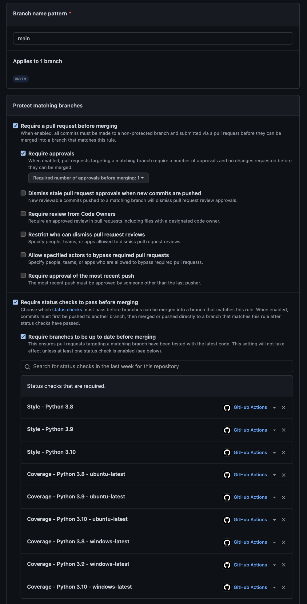
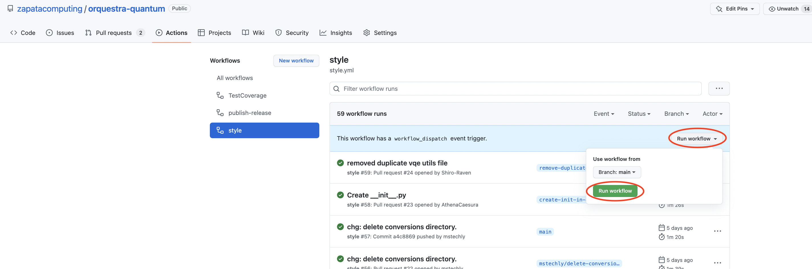

# orquestra-python-template
This is a template repository for Orquestra Python projects.

After creating repository from this template, make sure to follow the steps below:

1. Specify license. Supply LICENSE file and fill license entry in `setup.cfg` accordingly.
2. Update `setup.cfg`. At the very least update the following fields:
   - `[metadata]` section: `name`, `description`, `license`, `license_file`, 
   - `install_requires` in `[options]` section. You don't have to do this at the very beginning and you may add requirements as you go, but be wary that the ones present in this repository are only example ones and may not be applicable to your project.
3. Substitute an example `orquestra.pythontemplate` package `src/` directory with your actual code. Remember, that `orquestra` is a namespace package, so you *cannot* put an `__init__.py` in `src/orquestra` directory. Remove tests for the dummy package and replace them with meaningful ones as you develop your package.
4. (optional) Follow instructions below for setting up PR checks.
5. Delete PR_checks.png and manual_workflow_run.png from main directory.
6. Remove this instruction and replace it with a meaningful description of your package.


## Setting up PR Checks
Here we have instructions for making github perform checks automatically when contributors make a PR to main. These checks will prevent any merges to `main` which do not pass style and test checks, ensuring your repository is always clean and functional.

1. From the main directory of your repository on the `main` branch, run the commands
   ``` bash
   git subtree add -P subtrees/z_quantum_actions https://github.com/zapatacomputing/z-quantum-actions.git main --squash
   git push origin main
   ```
   If this step fails, contact quantum software team for help. Do not modify any content in the `subtrees` directory which is created by this command. Contact quantum software team if you need to change it.
2. From your repository's github page, go to settings.
3. Select branches on the left side bar and click add rule.
4. Check boxes and type in the status checks as shown below. If github cannot find status checks, go to steps 3 a-d. Otherwise, move on to step 4. 
  
   a. If github cannot find status checks you will have to run them manually. Click on the actions tab.
  
   b. For the TestCoverage and Style workflows, click run workflow and then click run workflow again in the green pop-up box.
  
   c. Wait a few minutes for the checks to pass, if they fail then check to make sure they work on your machine.
  
   d. Once the checks have been completed, add them as you would have in step 3.

5. If your repository has dependencies from orquestra-* libraries, repeat these steps for `style.yml` and `coverage.yml` in the `.github/workflows` directory.
   
   a. Uncomment the following lines of code
   ```yaml
   - name: Get orquestra-quantum
     uses: actions/checkout@v2
     with:
         repository: zapatacomputing/orquestra-quantum
         path: orquestra-quantum
         ssh-key: ${{ secrets.SSH_PRIVATE_KEY }}
   ```
   b. Replace all instances `orquestra-quantum` with name of the repository your code depends on.

   c. If the dependency is public, delete the last line: `ssh-key: ${{ secrets.SSH_PRIVATE_KEY }}`. If the dependency is private, keep this line and do the following:
      
      * Uncomment the following lines of code:
      ```yaml
       - uses: ./subtrees/z_quantum_actions/actions/ssh_setup
         with:
           ssh_key: ${{ secrets.SSH_PRIVATE_KEY }}
      ```

      * Add `SSH_PRIVATE_KEY` to Github secrets of this repo.

      * Add `readonly-bots` with read access to the dependency repo.

      * If you have multiple private dependencies, you will only need to do this once.

   d. Repeat this process for all your dependencies. When you are finished, you should have one of the above commands for each dependency.

6. If your repository has dependencies from orquestra-* libraries, open the `Makefile` in the main directory of your repository and do the following:

   a. Replace its contents with:
   ```makefile
   include subtrees/z_quantum_actions/Makefile

   github_actions:
      ${PYTHON_EXE} -m venv ${VENV_NAME}
      "${VENV_NAME}/${VENV_BINDIR}/${PYTHON_EXE}" -m pip install --upgrade pip
      "${VENV_NAME}/${VENV_BINDIR}/${PYTHON_EXE}" -m pip install -e ./<your-orquestra-dependency-here>
      "${VENV_NAME}/${VENV_BINDIR}/${PYTHON_EXE}" -m pip install -e '.[dev]'
   ```
   
   b. Replace `<your-orquestra-dependency-here>` in line 6 with the name of an orquestra dependency. Add similar lines for all other orquestra-* dependencies below line 6. At the end of this step, your `Makefile` should look something like this:
   ```makefile
   include subtrees/z_quantum_actions/Makefile

   github_actions:
      ${PYTHON_EXE} -m venv ${VENV_NAME}
      "${VENV_NAME}/${VENV_BINDIR}/${PYTHON_EXE}" -m pip install --upgrade pip
      "${VENV_NAME}/${VENV_BINDIR}/${PYTHON_EXE}" -m pip install -e ./orquestra-quantum
      "${VENV_NAME}/${VENV_BINDIR}/${PYTHON_EXE}" -m pip install -e ./orquestra-opt
      "${VENV_NAME}/${VENV_BINDIR}/${PYTHON_EXE}" -m pip install -e ./orquestra-vqa
      "${VENV_NAME}/${VENV_BINDIR}/${PYTHON_EXE}" -m pip install -e '.[dev]'
   ```

7. Open your terminal, navigate to the main directory of your repository, and run the following lines of code one by one:
   ```bash
   git checkout -b add-PR-dependencies
   git add .github/workflows/coverage.yml .github/workflows/style.yml Makefile
   git commit -m "feat(.github): added PR check dependencies"
   git push origin add-PR-dependencies
   ```
8. Create a pull request (PR) to main. The option to make a PR should appear once you go back to the github page for your repository after completing step 7.
9.  After making your PR, ensure that tests run and pass. If there are any persistent issues, contact quantum software team.
